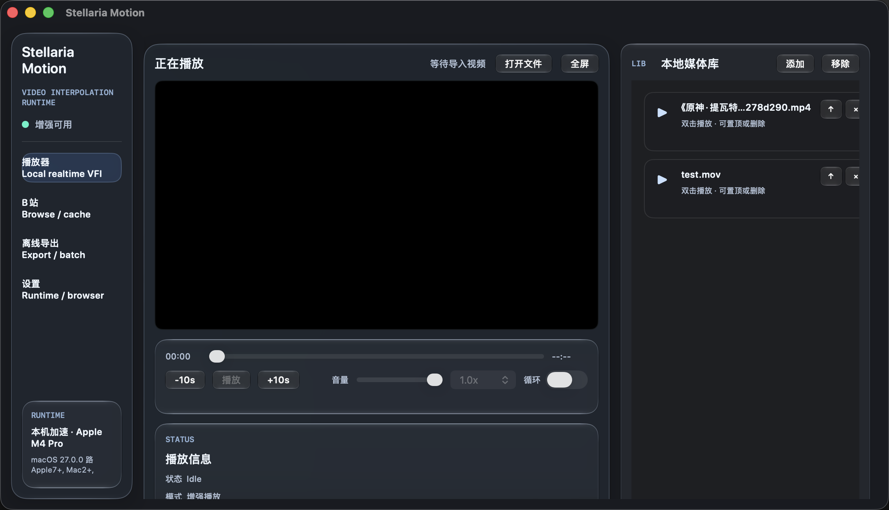
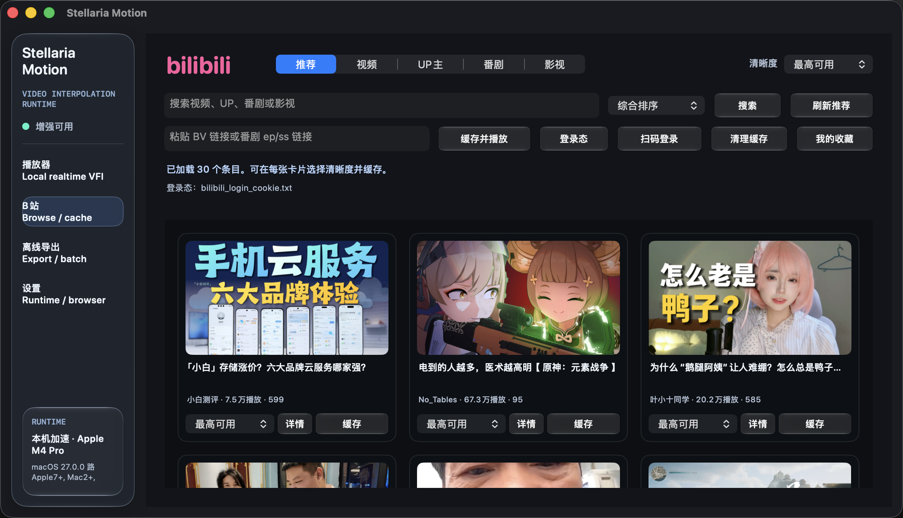
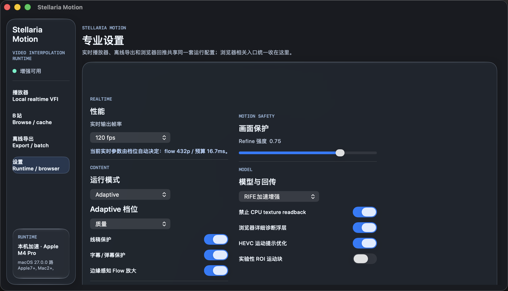

# Stellaria Motion

Apple Silicon native realtime video frame interpolation, built for smooth local playback, cached online video viewing, and offline export.

Stellaria Motion is the video-interpolation runtime from Stellaria Studio. The app keeps the stable path close to macOS media primitives: hardware decode, `CVPixelBuffer` / `IOSurface`, `CVMetalTextureCache`, Metal kernels, Stellaria SP4 inference, and direct presentation through `CAMetalLayer`.



## Highlights

- Native macOS player for local realtime VFI, with keyboard controls, fullscreen playback, library management, and low-copy Metal presentation.
- Bilibili browse/cache surface with recommendations, search, per-card quality selection, login state, favorites entry, episode-aware caching, detail panels, comments, and cache cleanup.
- Offline export pipeline for deterministic 2x/60 fps interpolation through AVFoundation reader/writer and the same RIFE/SP4 path used by realtime playback, with Metal/CI fallback when model assets are unavailable.
- Metal-first RIFE pipeline with SP4 acceleration, motion safety controls, subtitle/barrage protection, bitrate controls, and fixed-layout diagnostics.
- Chrome extension/native-host experiment kept as a compatibility lane, while the product default favors native cached playback for stability.

## Product Screens





## Why Not Pure Browser Realtime?

We spent a long stretch testing direct browser online interpolation: capture a page video, send frames to the native app, interpolate locally, and push frames back to the original browser position. In theory that sounds ideal. In practice the browser path had several hard stability problems:

- Different Chromium shells expose different video, compositor, and extension timing behavior. Google Chrome was usable; Atlas-style shells repeatedly showed long stalls.
- The input side was the weakest link. Frame readback and bridge delivery jitter made the app receive bursts instead of a steady video cadence.
- Returning frames through browser-facing buffers added queueing, copy, encode, and synchronization pressure. That caused intermittent stalls, audio/video drift, quality degradation, subtitle flicker, and "play for a while, freeze for a while" behavior.
- Browser power use climbed quickly because the browser and the native app both tried to own pacing.

The current stable direction is therefore:

```text
Online source metadata / user-authorized media
-> Native cache
-> AVFoundation / VideoToolbox hardware decode
-> CVMetalTextureCache zero-copy texture binding
-> Stellaria SP4 / Metal interpolation
-> CAMetalLayer presentation
```

The browser extension remains useful for experiments and diagnostics, but the release experience is built around native cached playback because it can be measured, paced, and kept stable.

## Powered by Stellaria SP4

Stellaria Motion consumes the real Stellaria SP4 SDK from the sibling checkout at `/Users/minsawa/Documents/Stellaria SP4` during local development. It is not a separate "Motion-only SP4" format. The Motion integration builds against the SDK headers and runtime concepts such as `.sp4` A1P assets, `sp4::LoadedAsset`, `sp4::RuntimePrepareOptions`, `sp4::PreparedRuntimeCache`, and the SP4 backend scheduling contract.

Motion's `RIFESP4Runner` is a product adapter around that SDK: SP4 owns the compressed asset, loader, prepared runtime cache, and scheduling intent; Motion owns the video-specific Metal texture packing, flow/mask execution, warp/blend, residual refine, pacing, and `CAMetalLayer` presentation.

SP4 matters here because realtime interpolation is not just model throughput. The full budget includes decode, upload/binding, inference, compositing, frame pacing, and output. Stellaria Motion treats SP4 as one stage in a measured media pipeline rather than a standalone benchmark.

The low-power online path deliberately trades quality for stability. To stay inside realtime frame budgets and avoid high CPU/GPU power draw, Motion may use lower flow resolution, stronger protection, conservative bitrate, and native-frame fallback. That means browser/cached online interpolation cannot guarantee offline-export-level sharpness or artifact suppression. Offline export is the quality-first path.

## Architecture

```text
Local file / cached online video
-> AVPlayerItemVideoOutput / AVAssetReader / VideoToolbox
-> CVPixelBuffer backed by IOSurface
-> CVMetalTextureCache
-> Motion RenderGraph
-> RIFE / Stellaria SP4 / Metal kernels
-> paced display or offline encoder
```

Core modules:

- `MotionCore`: public contracts, quality policy, pacing, diagnostics, and graph assembly.
- `MotionMetal`: Metal device, shader, texture, and command-buffer runtime pieces.
- `MotionVideo`: AVFoundation, VideoToolbox, local player, and offline processing boundaries.
- `MotionRIFEApple`: Apple Silicon RIFE and Stellaria SP4 integration.
- `MotionApp`: Objective-C++ macOS app shell and product UI.
- `BrowserAgent`: Chrome extension and native host for experimental browser bridge workflows.

More details live in:

- `docs/Stellaria Motion 技术报告.md`
- `docs/architecture.md`

## Build

```bash
./tools/build_app.sh
```

Open after building:

```bash
./tools/build_app.sh --open
```

Clean rebuild:

```bash
./tools/build_app.sh --clean
```

The script prefers Ninja, including CLion's bundled Ninja at `/Applications/CLion.app/Contents/bin/ninja/mac/aarch64/ninja`, and falls back to Unix Makefiles if Ninja is unavailable.

Manual CMake build:

```bash
cmake -S . -B build-app -G Ninja
cmake --build build-app --target StellariaMotionApp -j4
ctest --test-dir build-app --output-on-failure
```

For SP4-backed RIFE acceleration, keep the Stellaria SP4 SDK checkout available or override its path:

```bash
cmake -S . -B build-app -DSTELLARIA_SP4_SDK_DIR="/Users/minsawa/Documents/Stellaria SP4"
```

The public repository does not vendor the SP4 SDK or model weights into source control. Local development bundles `Models/RIFE-SP4/rife_sp4_a1p.sp4` when present, or falls back to the sibling SP4 build output.

Generate an Xcode project:

```bash
cmake -S . -B build-xcode -G Xcode
cmake --build build-xcode --config Debug
```

The build generates `MotionKernels.metallib` on macOS and bundles it into the app. If Xcode reports a missing Metal toolchain, install Apple's Metal toolchain component and rebuild.

## Realtime Validation

`RealtimeVFITestCLI` runs the realtime backend against a real local video and reports backend execution, generated frames, GPU timing, coverage, effective fps, realtime factor, and optional `powermetrics` samples.

```bash
./build-app/RealtimeVFITestCLI --frames 24
./build-app/RealtimeVFITestCLI --full-video
./build-app/RealtimeVFITestCLI --backend int4 --frames 24
sudo ./build-app/RealtimeVFITestCLI --frames 120 --sample-power
```

The default test asset is `Tests/Media/test.mov`. `--sample-power` uses macOS `powermetrics`, so it usually requires sudo/root; without that privilege the CLI still reports interpolation and GPU timing.

## Browser Native Host

The browser path is experimental and maintained for Google Chrome only.

```bash
./tools/build_app.sh
```

Load `Sources/BrowserAgent/extension` as an unpacked extension in Google Chrome, copy the extension id, then install the native host manifest:

```bash
./tools/install_chrome_native_host.sh --browser chrome <extension-id> ./build-app/StellariaMotionApp.app/Contents/MacOS/StellariaMotionNativeHost
```

Other Chromium-based shells may expose similar APIs, but they are not a stability target for this release.

## Model Assets

Reference RIFE assets used during development are stored under `Models/` and ignored by git:

```bash
./tools/download_models.sh
```

Runtime inference is designed around native Metal, Core ML, and SP4 paths rather than Python or PyTorch.

Core ML conversion helpers are included for experimentation:

```bash
python3 -m venv /tmp/stellaria-coreml-venv
/tmp/stellaria-coreml-venv/bin/python -m pip install 'numpy<2' 'coremltools>=8,<9' 'torch>=2.1' 'safetensors>=0.4'
/tmp/stellaria-coreml-venv/bin/python tools/convert_rife_conv_trunk_coreml.py --width 960 --height 544
```

## Boundaries

- DRM bypass is unsupported.
- Bilibili login/cache features rely on the user's own account permissions.
- The app does not redistribute paid media permissions.
- The stable playback target is native cached or local media. Browser return remains an experimental compatibility lane.
- Low-power online interpolation prioritizes stable playback and power control over maximum quality; visible softness or conservative fallback can happen when the realtime budget is tight.
- The runtime avoids CPU texture readback on the realtime path whenever possible.

## License

Stellaria Motion is copyright (C) 2026 Stellaria Studio and licensed under the GNU Affero General Public License version 3. See `LICENSE`.

Powered by Stellaria SP4.

Bundled or optionally downloaded RIFE reference assets retain their upstream license and copyright notices. The reference safetensors package used by development builds includes the MIT license notice from Megvii Inc.
